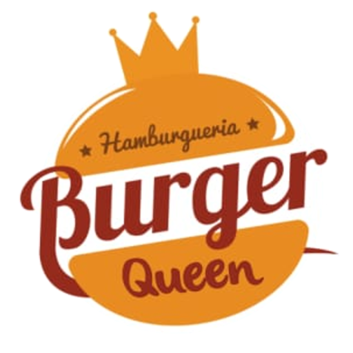

# Burger Queen

## Índice

* [1. Resumo do projeto](#1-resumo-do-projeto)
* [2. Objetivos de aprendizagem e Considerações gerais](#2-objetivos-de-aprendizagem-e-considerações-gerais)
* [3. Critérios de aceitação mínimos cumpridos pelo projeto](#4-critérios-de-aceitação-mínimos-cumpridos-pelo-projeto)

***

## 1. Resumo do projeto

Foi criado uma interface para ser utilizado em um _tablet_, onde é possível realizar pedidos e enviá-los
para a cozinha.

Seguem as informações sobre o cliente:

> Somos **Burger Queen**, um fast food 24hrs.
>
>A nossa proposta de serviço 24 horas foi muito bem recebida e, para continuar a
>crescer, precisamos de um sistema que nos ajude a receber pedidos de nossos
>clientes.
>
>Nós temos 2 menus. Um muito simples para o café da manhã:
>
>| Ítem                      |Preço R$|
>|---------------------------|------|
>| Café americano            |    5 |
>| Café com leite            |    7 |
>| Misto Quente              |   10 |
>| Suco de fruta natural     |    7 |
>
>E outro menu para o resto do dia:
>
>| Ítem                      |Preço |
>|---------------------------|------|
>|**Hambúrgueres**           |   **R$**   |
>|Hambúrguer simples         |    10|
>|Hambúrguer duplo           |    15|
>|**Acompanhamentos**        |   **R$**   |
>|Batata frita               |     5|
>|Anéis de cebola            |     5|
>|**Bebidas**                |   **R$**   |
>|Água 500ml                 |     5|
>|Água 750ml                 |     7|
>|Refrigerante 500ml         |     7|
>|Refrigerante 750ml         |    10|
>
>**Importante:** Os clientes podem escolher entre hambúrgueres de carne bovina,
>frango ou vegetariano. Além disso, por um adicional de R$ 1,00 , eles podem
>adicionar queijo ou ovo.
>
>Nossos clientes são bastante indecisos, por isso é muito comum que eles mudem o
>seu pedido várias vezes antes de finalizar.

A interface mostra os dois menus (café da manhã e restante do dia), cada
um com todos os seus _produtos_. O usuário pode escolher que _produtos_
adicionar e a interface mostra o _resumo do pedido_ com o custo total.

O aplicativo pode ser visualizado junto ao link: https://burger-queen-3311b.web.app/

## 2. Objetivos de aprendizagem e Considerações Gerais

O objetivo principal envolveu o aprendizado da construção de uma interface web usando _React_. A interface também foi planejada especificamente para rodar em **tablets**. O aplicativo é um _Single Page App_.

O aplicativo utilizou scripts `npm-scripts` e teve `start`, `build` e `deploy`, que são responsáveis por iniciar, empacotar e implantar o aplicativo, respectivamente.

## 3. Critérios de aceitação mínimos cumpridos pelo projeto

#### [História de usuário 1] Garçom/Garçonete deve poder anotar o seu pedido

Eu como cliente quero poder anotar o meu pedido saber o valor de cada 
produto e poder enviar o pedido para a cozinha para ser preparado.

##### Critérios de aceitação que foram atendidos.

* Anotar o nome e mesa.
* Adicionar produtos aos pedidos.
* Excluir produtos.
* Ver resumo e o total da compra.
* Enviar o pedido para a cozinha (guardar em algum banco de dados).
* Funcionar bem e se adequar a um _tablet_.

##### Definição de pronto

* Foram feitos _testes_ de usabilidade e incorporado o _feedback_ do usuário.
* Foi feito o _deploy_ do aplicativo.

***

## Checklist

### `README.md`

* [ ] Documentação do processo de design.
* [ ] Inclui informações para desenvolvedores (dependências, instalação, uso, testes...)

#### HU

#### HU 1: Anotar pedidos

* [ ] Digitar o nome do cliente.
* [ ] Digitar a mesa.
* [ ] Filtrar _menu_ para _café da manhã_ e _almoço/jantar_.
* [ ] Adicionar item ao pedido.
* [ ] Excluir item do pedido.
* [ ] Mostrar _resumo_ do pedido com todos os itens e o total.
* [ ] Enviar para a cozinha (isso deve salvar o pedido).

### UX

* [ ] Funciona bem em tablets.
* [ ] Fácil utilização em telas sensíveis ao toque.
